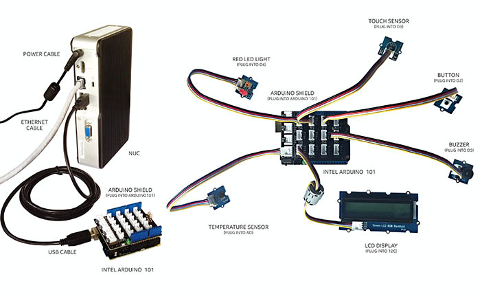
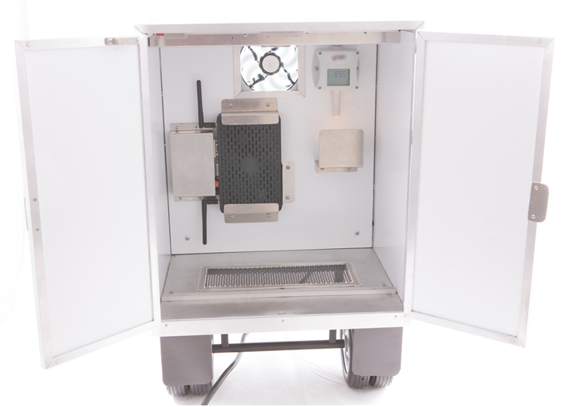
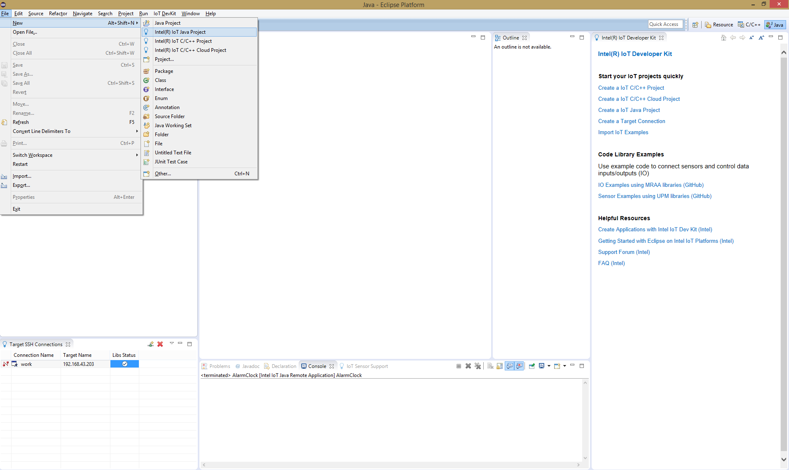
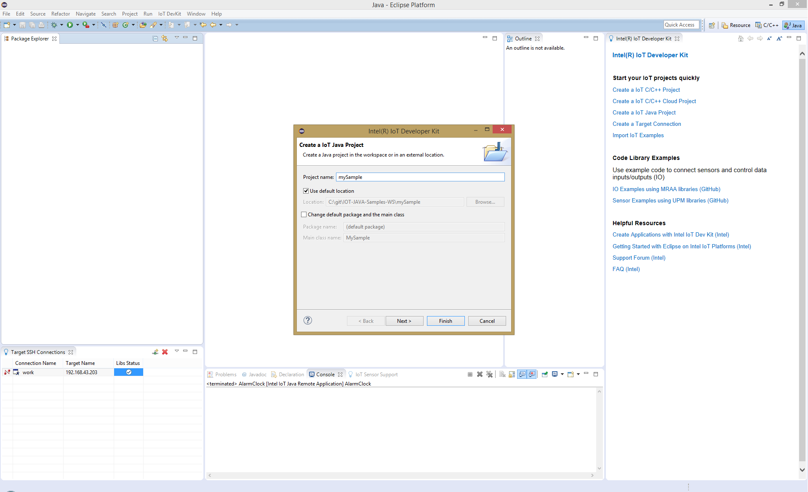
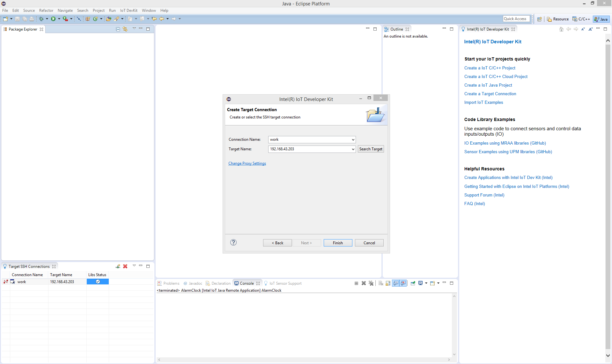
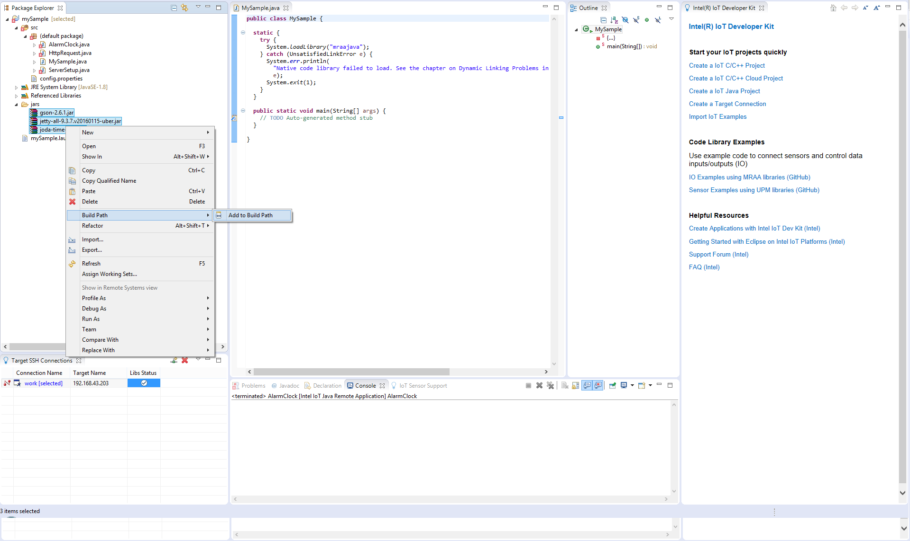
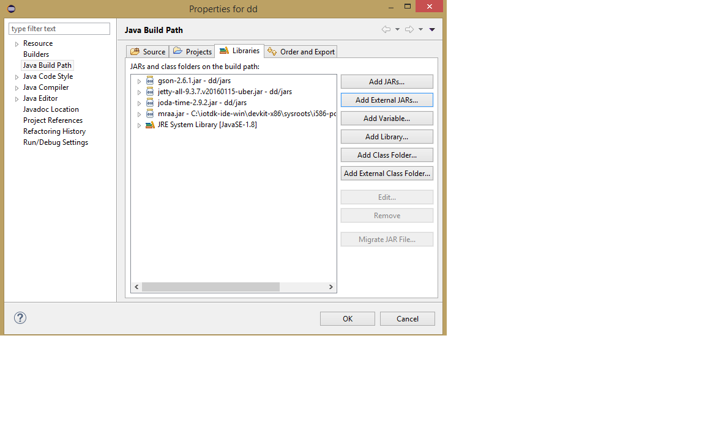

# Path to Product Transportation

## How to build the prototype

From this exercise, developers will learn how to do the following:
* Connect to the Intel® NUC Kit DE3815TYKHE.
* Interface with the I/O and sensor repository for the Intel® NUC using MRAA and UPM
from the Intel® IoT Developer Kit, a complete hardware and software solution to help
developers explore IoT and implement innovative projects.
* Run the Java* code sample in Intel® System Studio IoT Edition, an IDE for creating
applications that interact with sensors and actuators, enabling a quick start for
developing software for Intel® IoT Platforms.
* Visit GitHub* for the latest code samples and documentation.

### What it Does

This project simulates the following parts of a Transportation monitoring solution:
* **Door** The door can be closed or opened, in which case the driver signaled that
something might be wrong.
* **Temperature** The temperature inside the truck is being monitored. The data is logged
and above a certain threshold an alarm is raised.
* **Alarm** Under certain conditions an alarm is raised. The alarm can be canceled by
pressing the touch button or when the parameters of the system return to normal.
* **Display** Displays the status of the system, temperature and door status.

### How it Works

This transporation application operates based on the following sensor data:
* Open/closed status of the truck door
* Temperature of the truck interior
* Events: open/close door, change temperature, set temperature threshold, trigger/stop
alarm

All data is forwarded to the web interface, which can be used to monitor the status of the truck.

### Set up the Intel® NUC Kit DE3815TYKHE

This section gives instructions for installing the Intel® IoT Gateway Software Suite on the Intel®
NUC.

*Note:* Due to the limited size of the local storage drive, we recommend against setting a
recovery partition. You can return to the factory image by using the USB drive again.
You can now use your gateway remotely from your development machine if you are on the
same network as the gateway. If you would like to use the Intel® IoT Gateway Developer Hub
instead of the command line, enter the IP address into your browser and go through the first-
time setup.

*Note:* If you are on an Intel® network, you need to set up a proxy server.

1. Create an account on the Intel® IoT Platform Marketplace if you do not already have
one.
2. Order the Intel® IoT Gateway Software Suite, and then follow the instructions you will
receive by email to download the image file.
3. Unzip the archive, and then write the .img file to a 4 GB USB drive:
  1. On Microsoft Windows*, you can use a tool like Win32 Disk Imager*:
  https://sourceforge.net/projects/win32diskimager
  2. On Linux*, use sudo dd if=GatewayOS.img of=/dev/ sdX bs=4M; sync, where
  sdX is your USB drive.

4. Unplug the USB drive from your system, and then plug it into the Intel® NUC along with a
monitor, keyboard, and power cable.
5. Turn on the Intel® NUC, and then enter the BIOS by pressing F2 at boot time.
6. Boot from the USB drive:
  1. From the Advanced menu, select Boot.
  2. From Boot Configuration, under OS Selection, select Linux.
  3. Under Boot Devices, make sure the USB check box is selected.
  4. Save the changes, and then reboot the system.
  5. Press F10 to enter the boot selection menu, and then select the USB drive.
7. Log in to the system with root:root.
8. Install Wind River* Linux* on local storage:
  ```  ~# deploytool ­d /dev/mmcblk0 ­­lvm 0 ­­reset­media –F ```
9. Use the poweroff command to shut down your gateway, unplug the USB drive, and then
turn your gateway back on to boot from the local storage device.
10. Plug in an Ethernet cable, and then use the ifconfig eth0 command to find the IP address
assigned to your gateway (assuming you have a proper network setup).
11. Use the Intel® IoT Gateway Developer Hub to update the MRAA and UPM repositories to
the latest versions from the official repository (https://01.org). You can achieve the same
result by entering the following commands:
```
 ~# smart update
 ~# smart upgrade
 ~# smart install upm
```
12. Plug in an Arduino* 101 board, and then reboot the Intel® NUC. The Firmata* sketch is
flashed onto Arduino 101, and you are now ready to use MRAA and UPM with it.

Set up the Arduino* 101 Board
----

Setup instructions for the Arduino* 101 board are available at
https://www.arduino.cc/en/Guide/Arduino101.

Connect other Components
----

This section covers making the connections from the Intel® NUC to the rest of the hardware
components. The bill of materials for the prototype is summarized in Table 1, and the assembly
of those components is illustrated in Figure 1.

Table 1. Transportation prototype components.

|         | Component | Details  |
|---------|----------|-----------|
|Base System| [Intel® NUC Kit DE3815TYKHE](http://www.intel.com/content/www/us/en/support/boards­and­kits/intel­nuc­kits/intel­nuc-kit-de3815tykhe.html) ||
||  [Arduino* 101 Board](https://www.arduino.cc/en/Main/ArduinoBoard101) | Sensor hub |
|| USB Type A to Type B Cable |For connecting Arduino 101 board to NUC |
| Components from Grove* Starter Kit Plus IoT Edition | [Base Shield V2](http://www.seeedstudio.com/depot/Base-Shield-V2-p-1378.html) | |
|| [Button Module](http://www.seeedstudio.com/depot/Grove-Button-p-766.html) | Door toggle |
|| [Temperature Sensor](http://seeedstudio.com/depot/Grove-Temperature-Sensor-p-774.html) | Monitors temperature |
|| [Touch Sensor Module](http://www.seeedstudio.com/depot/Grove-Touch-Sensor-p-747.html) | Alarm mute |
|| [Red LED](http://www.seeedstudio.com/depot/Grove-Red-LED-p-1142-html) | Alarm status light |
|| [LCD with RGB Backlight Module](http://www.seeedstudio.com/depot/Grove-LCD-RGB-Backlight-p-1643.html) | Status display |
|| [Buzzer Module](http://www.seeedstudio.com/depot/Grove-Buzzer-p-768.html) | Alarm |



Figure 1. Transportation proof of concept prototype.

## How to build the product

From this exercise, developers will learn how to do the following:
* Connect to the Dell* Wyse 3290.
* Interface with the I/O and sensor repository using MRAA and UPM
from the Intel® IoT Developer Kit, a complete hardware and software solution to help
developers explore IoT and implement innovative projects.
* Run the code sample in Intel® System Studio IoT Edition, an IDE for creating
applications that interact with sensors and actuators, enabling a quick start for
developing software for Intel® IoT Platforms.
* Visit GitHub* for the latest code samples and documentation.

### What it Does

This project simulates the following parts of a Transportation monitoring solution:
* **Door** The door can be closed or opened, in which case the driver signaled that
something might be wrong.
* **Temperature** The temperature inside the truck is being monitored. The data is logged
and above a certain threshold an alarm is raised.
* **Alarm** Under certain conditions an alarm is raised. The alarm status can be monitored using the web UI, and canceled and monitored through the WebAppUI or mobile application.
* **Display** Displays the status of the truck on the WebAppUI or mobile application.

### How it Works

This transportation application operates based on the following sensor data:
* Open/closed status of the truck door
* Temperature of the truck interior
* Events: open/close door, change temperature, set temperature threshold, trigger/stop
alarm

All data is forwarded to the admin application, which can be used to monitor the status of the truck.

### Set up the Dell* Wyse 3290

This section gives instructions for installing the Intel® IoT Gateway Software Suite on the Dell* Wyse 3290.

*Note:* If you are on an Intel® network, you need to set up a proxy server.

1. Create an account on the Intel® IoT Platform Marketplace if you do not already have
one.
2. Order the Intel® IoT Gateway Software Suite, and then follow the instructions you will
receive by email to download the image file.
3. Unzip the archive, and then write the .img file to a 4 GB USB drive:
  1. On Microsoft Windows*, you can use a tool like Win32 Disk Imager*:
  https://sourceforge.net/projects/win32diskimager
  2. On Linux*, use sudo dd if=GatewayOS.img of=/dev/ sdX bs=4M; sync, where
  sdX is your USB drive.

4. Unplug the USB drive from your system, and then plug it into the Dell* Wyse 3290 along with a
monitor, keyboard, and power cable.
5. Turn on the Dell Wyse 3290, and then enter the BIOS by pressing F2 at boot time.
6. Boot from the USB drive:
  1. On the **Advanced** tab, make sure **Boot from USB** is enabled.
  2. On the **Boot** tab, put the USB drive first in the order of the boot devices.
  3. Save the changes, and then reboot the system.
7. Log in to the system with root:root.
8. Install Wind River* Linux* on local storage:
  ```  ~# deploytool ­d /dev/mmcblk0 ­­lvm 0 ­­reset­media –F ```
9. Use the poweroff command to shut down your gateway, unplug the USB drive, and then
turn your gateway back on to boot from the local storage device.
10. Plug in an Ethernet cable, and then use the ifconfig eth0 command to find the IP address
assigned to your gateway (assuming you have a proper network setup).
11. Use the Intel® IoT Gateway Developer Hub to update the MRAA and UPM repositories to
the latest versions from the official repository (https://01.org). You can achieve the same
result by entering the following commands:
```
 ~# smart update
 ~# smart upgrade
 ~# smart install upm
```
12. Connect the FTDI* UMFT4222EV expansion board through an USB cable.
13. Connect the Comet* T3311 Temperature sensor to the serial port.

### Connect other Components

This section covers making the connections from the Dell* Wyse 3290 to the rest of the hardware
components. The bill of materials for the prototype is summarized in Table 1, and the assembly
of those components is illustrated in Figure 1.

Table 2. Transportation prototype components.

|         | Component | Details  |
|---------|----------|-----------|
|Base System| [Dell* Wyse 3290](http://www.dell.com/us/business/p/wyse-3000-series/pd) | |
||  [FTDI UMFT4222EV](http://www.ftdichip.com/Products/Modules/DevelopmentModules.htm#UMFT4222EV) | |
|| USB Type A to Type Micro-B Cable | For connecting UMFT4222EV board to Gateway | |
| Sensors | [Comet T3311](http://www.cometsystem.com/products/reg-T3311) | Temperature sensor |
|| [Grove* - SPDT Relay(30A)](http://www.seeedstudio.com/wiki/Grove_-_SPDT_Relay\(30A\)) | Fan/light control |
|| [Magnetic Switch](https://www.adafruit.com/product/375) | Door sensor |
|| 10uF Capacitor (Optional) ||
|| 5V DC Lightbulb  |  |
|| 5V DC Fan  |  |



Figure 2. Transportation proof of concept prototype.

### How to set up

To begin, clone the **Path to Product** repository with Git* on your computer as follows:

    $ git clone https://github.com/intel-iot-devkit/path-to-product.git

To download a .zip file, in your web browser go to [](https://github.com/intel-iot-devkit/path-to-product) and click the **Download ZIP** button at the lower right. Once the .zip file is downloaded, uncompress it, and then use the files in the directory for this example.

## Adding the program to Intel® System Studio IoT Edition

 ** The following screenshots are from the Alarm clock sample, however the technique for adding the program is the same, just with different source files and jars.

Open Intel® System Studio IoT Edition, it will start by asking for a workspace directory. Choose one and then click OK.

In Intel® System Studio IoT Edition , select File -> new -> **Intel(R) IoT Java Project**:



Give the project the name "Transportation Demo" and then click Next.



You now need to connect to your Intel® NUC from your computer to send code to it.
Choose a name for the connection and enter IP address of the Intel® NUC in the "Target Name" field. You can also try to Search for it using the "Search Target" button. Click finish when you are done.



You have successfully created an empty project. You now need to copy the source files and the config file to the project.
Drag all of the files from your git repository's "src" folder into the new project's src folder in Intel® System Studio IoT Edition. Make sure previously auto-generated main class is overridden.

The project uses the following external jars: [commons-cli-1.3.1.jar](http://central.maven.org/maven2/commons-cli/commons-cli/1.3.1/commons-cli-1.3.1.jar), [tomcat-embed-core.jar](http://central.maven.org/maven2/org/apache/tomcat/embed/tomcat-embed-core/8.0.36/tomcat-embed-core-8.0.36.jar), [tomcat-embed-logging-juli](http://central.maven.org/maven2/org/apache/tomcat/embed/tomcat-embed-logging-juli/8.0.36/tomcat-embed-logging-juli-8.0.36.jar). These can be found in the Maven Central Repository. Create a "jars" folder in the project's root directory, and copy all needed jars in this folder.
In Intel® System Studio IoT Edition, select all jar files in "jars" folder and  right click -> Build path -> Add to build path



Now you need to add the UPM jar files relevant to this specific sample.
right click on the project's root -> Build path -> Configure build path. Java Build Path -> 'Libraries' tab -> click on "add external JARs..."

for this sample you will need the following jars:

1. upm_buzzer.jar
2. upm_grove.jar
3. upm_i2clcd.jar
4. upm_t3311.jar
5. upm_ttp223.jar
6. mraa.jar

The jars can be found at the IOT Devkit installation root path\iss-iot-win\devkit-x86\sysroots\i586-poky-linux\usr\lib\java



Afterwards, copy the www folder to the home directory on the target platform using scp or WinSCP.
Create a new Run configuration in Eclipse for the project for the Java Application. Set the Main Class as: ```com.intel.pathtoproduct.JavaONEDemoMulti``` in the Main tab. Then, in the arguments tab:
* For the devkit version (with Intel® NUC):
```  -config devkit -webapp <path/to/www/folder> -firmata ```
* For the commercial version (with Dell* Wyse 3290):
``` -config commercial -webapp <path/to/www/folder> ```


## Running without an IDE

Download the repo directly to the target plaform and run the ``` start_devkit.sh ``` or ``` start_commercial.sh ``` scripts.

